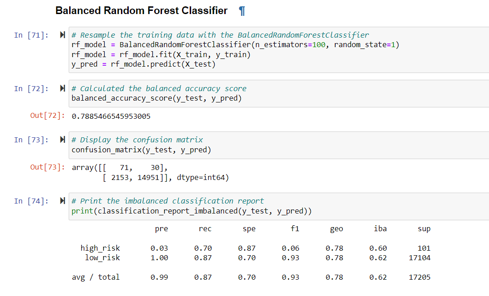
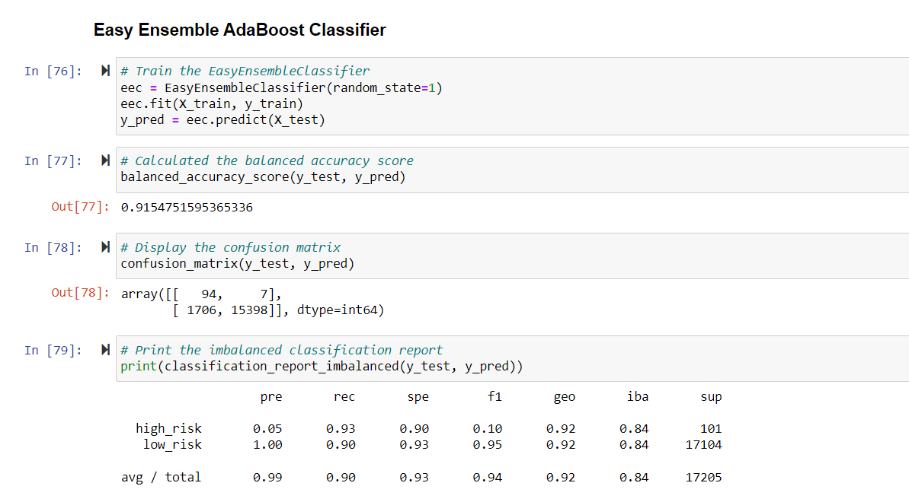
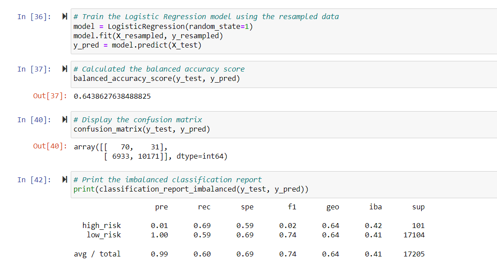
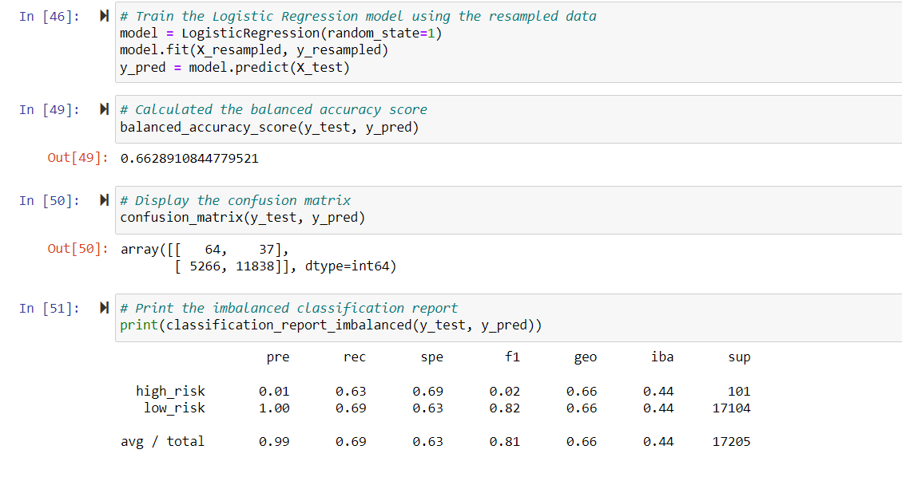
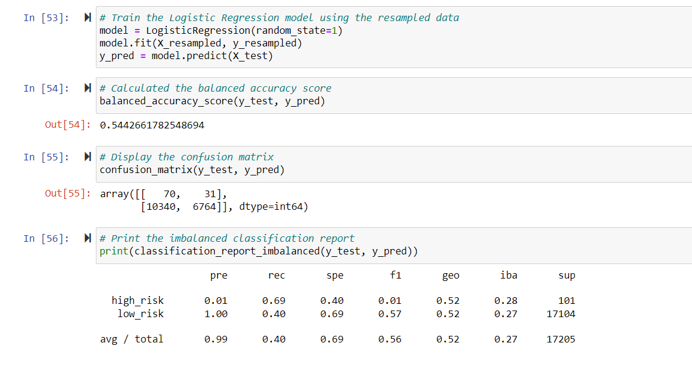

# Credit_Risk_Analysis
Credit Risk Analysis

## Overview of the loan prediction risk analysis:

 This module involves credit risk which is an inherently unbalanced classification problem. Differennt techniques will be employed to train and evaluate models with unbalanced classes.

## Results:

There is a bulleted list that describes the balanced accuracy score and the precision and recall scores of all six machine learning models (15 pt)

Precision Score= (Predicted True/ (Predicted True + False Positive)
Precision(Precision, also known as positive predictive value (PPV)) = TP/(TP + FP)

Recall Score= (Predicted True/ Predicted True + False Negative)
Sensitivity(Recall) = TP/(TP + FN)

Recall Score= (Predicted True/ Predicted True + False Negative)

F1 Score(Harmonic Mean) =2(Precision * Sensitivity)/(Precision + Sensitivity)

### BalancedRandomForestClassifier

 
Accuracy_score (r_squared)= .78
Precision= .99
Recall= .87

### Ensemble AdaBoost Classifier

Accuracy_score (r_squared)= .91
Precision= .99
Recall= .90

### Naive Random Oversampling w/ Logistic Regression

Accuracy_score (r_squared)= .64
Precision= .99
Recall= .60

### SMOTE Oversampling w/ Logistic Regression

Accuracy_score (r_squared)= .66
Precision= .99
Recall= .69

### ClusterCentroids Undersampling w/ Logistic Regression

Accuracy_score (r_squared)= .54
Precision= .99
Recall= .40

### Combination (Over and Under) Sampling w/ Logistic Regression

_Sampling.PNG)

Accuracy_score (r_squared)= .63
Precision= .99
Recall= .58

## Summary:

Overall, the best model that was generated to predict the unbalanced classification problem of credit risk is the Ensemble AdaBoost Classifier as well as the Balanced Random Forest Classifier due to their high precision, recall, and accuracy scores being near 1 which is what we want in this prediction problem. But I would recommend the Ensemble AdaBoost Classifier due to its higher overall scores for a classification prediction.
